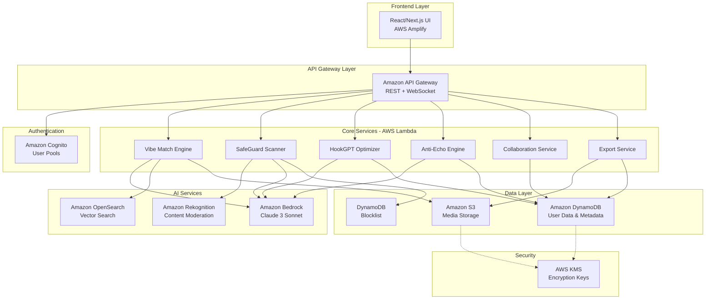

# Design Document: CreatorOS

## Overview

CreatorOS is a serverless, AI-powered content creation platform built on AWS infrastructure. The system provides an integrated workflow for content creators to script, discover assets, validate compliance, and optimize content for viral performance. The architecture follows a microservices pattern with four core engines: Vibe_Match_Engine (semantic asset discovery), SafeGuard_Scanner (compliance validation), HookGPT_Optimizer (script optimization), and Anti_Echo_Engine (trend filtering).

The platform leverages Amazon Bedrock for LLM capabilities, Amazon Rekognition for content moderation, Amazon OpenSearch for vector-based semantic search, and AWS Lambda for serverless compute. All user data is encrypted at rest and in transit, with authentication managed through Amazon Cognito.

## Architecture

### High-Level Architecture



### Service Communication Patterns

1. **Synchronous REST API**: Used for asset search, compliance scanning, and script optimization (< 200ms latency requirement)
2. **Asynchronous Processing**: Used for long-running tasks like full video analysis and fact-checking (via SQS + Lambda)
3. **WebSocket Connections**: Used for real-time collaboration features (via API Gateway WebSocket API)
4. **Event-Driven**: DynamoDB Streams trigger Lambda functions for analytics and audit logging

### Scalability Strategy

- **Auto-scaling**: Lambda functions scale automatically based on concurrent requests
- **Caching**: CloudFront CDN caches static assets and API responses with 5-minute TTL
- **Database Partitioning**: DynamoDB tables partitioned by user_id for even distribution
- **Vector Search Optimization**: OpenSearch cluster with 3 data nodes, auto-scaling enabled

## Components and Interfaces

### 1. Vibe Match Engine

**Purpose**: Semantic asset discovery using natural language "vibe" descriptions

**Key Components**:
- `VibeInterpreter`: Converts vibe descriptions to embedding vectors using Amazon Bedrock
- `AssetSearcher`: Queries OpenSearch vector database for semantically similar assets
- `LicenseValidator`: Filters results to ensure only royalty-free or licensed assets are returned
- `ResultRanker`: Ranks assets by semantic similarity score and licensing status

**Interface**:
```python
class VibeMatchEngine:
    def search_assets(
        self,
        vibe_description: str,
        asset_types: List[AssetType],  # ['image', 'audio', 'video']
        max_results: int = 20
    ) -> AssetSearchResult:
        """
        Search for assets matching a vibe description.
        
        Returns:
            AssetSearchResult containing:
            - assets: List[Asset] with metadata and URLs
            - similarity_scores: List[float] (0.0 to 1.0)
            - search_time_ms: int
        """
        pass
    
    def get_asset_preview(
        self,
        asset_id: str
    ) -> AssetPreview:
        """
        Get preview data for an asset (thumbnail or audio snippet).
        """
        pass
```

**Implementation Details**:
- Vibe descriptions are embedded using Amazon Bedrock's Titan Embeddings model (1536 dimensions)
- OpenSearch k-NN index with HNSW algorithm for fast approximate nearest neighbor search
- Asset metadata stored in S3 with DynamoDB index for quick lookups
- Licensing information cached in ElastiCache Redis for 1-hour TTL

### 2. SafeGuard Scanner

**Purpose**: Multi-layered compliance validation for copyright, policy, and factual accuracy

**Key Components**:
- `CopyrightDetector`: Audio fingerprinting and visual content matching against blocklist
- `PolicyValidator`: Content moderation using Amazon Rekognition and text analysis
- `FactChecker`: Claim extraction and verification using AI agents with web search
- `ComplianceAggregator`: Combines all check results into Safety_Pass status

**Interface**:
```python
class SafeGuardScanner:
    def scan_content_draft(
        self,
        content_draft_id: str
    ) -> ComplianceReport:
        """
        Perform full compliance scan on a content draft.
        
        Returns:
            ComplianceReport containing:
            - copyright_status: CheckStatus
            - policy_status: CheckStatus
            - fact_check_status: CheckStatus
            - safety_pass: bool
            - violations: List[Violation]
            - remediation_steps: List[str]
        """
        pass
    
    def check_copyright(
        self,
        media_file_url: str
    ) -> CopyrightCheckResult:
        """
        Check a single media file for copyright violations.
        """
        pass
    
    def check_policy(
        self,
        content_draft_id: str,
        platforms: List[Platform]  # ['youtube', 'instagram', 'linkedin']
    ) -> PolicyCheckResult:
        """
        Validate content against platform-specific policies.
        """
        pass
    
    def check_facts(
        self,
        script_text: str
    ) -> FactCheckResult:
        """
        Extract and verify factual claims in script.
        """
        pass
```

**Implementation Details**:

**Copyright Detection**:
- Audio fingerprinting using Chromaprint algorithm, stored in DynamoDB
- Visual content matching using Amazon Rekognition's segment detection
- Blocklist stored in DynamoDB with GSI on content_hash for O(1) lookups
- Parallel processing of audio and video tracks using Lambda concurrency

**Policy Validation**:
- Amazon Rekognition Content Moderation API for visual content (detects violence, nudity, hate symbols)
- Amazon Comprehend for text sentiment and toxic language detection
- Platform-specific rule engine stored as JSON configurations in S3
- Custom ML model (fine-tuned Bedrock) for nuanced policy interpretation

**Fact Checking**:
- Claim extraction using Amazon Bedrock with prompt engineering: "Extract all factual claims from this text as a JSON array"
- Web search integration via Tavily API or SerpAPI for source retrieval
- Source credibility scoring based on domain reputation database
- Claim verification using Amazon Bedrock with retrieved sources as context

### 3. HookGPT Optimizer

**Purpose**: Script optimization with viral hook insertion and platform-specific metadata generation

**Key Components**:
- `ScriptAnalyzer`: Analyzes script structure, tone, and content themes
- `HookGenerator`: Creates pattern interrupt hooks using viral content patterns
- `MetadataGenerator`: Generates platform-optimized captions, hashtags, and descriptions
- `ScriptEditor`: Inserts hooks while preserving original content integrity

**Interface**:
```python
class HookGPTOptimizer:
    def optimize_script(
        self,
        script_text: str,
        target_platform: Platform,
        content_niche: str
    ) -> OptimizedScript:
        """
        Analyze script and insert viral hooks.
        
        Returns:
            OptimizedScript containing:
            - optimized_text: str (with hooks inserted)
            - hooks: List[Hook] with positions and types
            - metadata: PlatformMetadata
            - retention_prediction: float (0.0 to 1.0)
        """
        pass
    
    def generate_metadata(
        self,
        script_text: str,
        target_platform: Platform
    ) -> PlatformMetadata:
        """
        Generate platform-specific captions, hashtags, and descriptions.
        """
        pass
```

**Implementation Details**:
- Script analysis using Amazon Bedrock (Claude 3 Sonnet) with structured output
- Hook patterns database stored in DynamoDB with engagement metrics
- Multi-language support using Bedrock's multilingual capabilities
- Platform-specific prompt templates for metadata generation:
  - Instagram: 30 hashtags, emoji-rich captions, 2200 char limit
  - YouTube: SEO-optimized titles, detailed descriptions, 15 tags
  - LinkedIn: Professional tone, 3-5 hashtags, thought leadership angle

### 4. Anti-Echo Engine

**Purpose**: Trend filtering and niche-specific content recommendation

**Key Components**:
- `TrendAggregator`: Collects trending content from platform APIs
- `SaturationAnalyzer`: Calculates trend saturation metrics using time-series data
- `NicheScorer`: Ranks content based on user's historical performance data
- `UniquenessCalculator`: Computes uniqueness scores based on content similarity

**Interface**:
```python
class AntiEchoEngine:
    def get_recommendations(
        self,
        user_id: str,
        niche: str,
        count: int = 10
    ) -> RecommendationList:
        """
        Get filtered content recommendations for a user.
        
        Returns:
            RecommendationList containing:
            - recommendations: List[ContentIdea]
            - uniqueness_scores: List[float] (0.0 to 1.0)
            - engagement_predictions: List[float]
            - saturation_levels: List[float]
        """
        pass
    
    def calculate_saturation(
        self,
        content_theme: str,
        time_window_days: int = 30
    ) -> float:
        """
        Calculate saturation level for a content theme.
        Returns value between 0.0 (unique) and 1.0 (oversaturated).
        """
        pass
```

**Implementation Details**:
- Trend data collected via YouTube Data API, Instagram Graph API, TikTok API
- Saturation calculated as: `saturation = (recent_posts / total_posts) * recency_weight`
- User performance data stored in DynamoDB with time-series attributes
- Recommendation ranking formula: `score = (1 - saturation) * niche_fit * predicted_engagement`
- Content embeddings stored in OpenSearch for similarity detection

### 5. Collaboration Service

**Purpose**: Real-time multi-user collaboration on content drafts

**Key Components**:
- `SessionManager`: Manages WebSocket connections and user presence
- `ChangeSync`: Broadcasts edits to all active collaborators
- `ConflictResolver`: Handles concurrent edit conflicts using last-write-wins
- `VersionControl`: Maintains version history of content drafts

**Interface**:
```python
class CollaborationService:
    def join_session(
        self,
        content_draft_id: str,
        user_id: str,
        connection_id: str
    ) -> SessionInfo:
        """
        Join a collaborative editing session.
        """
        pass
    
    def broadcast_change(
        self,
        content_draft_id: str,
        change: ContentChange,
        author_id: str
    ) -> None:
        """
        Broadcast a change to all active collaborators.
        Must complete within 1 second.
        """
        pass
    
    def get_version_history(
        self,
        content_draft_id: str
    ) -> List[Version]:
        """
        Retrieve version history for a content draft.
        """
        pass
```

**Implementation Details**:
- WebSocket API via Amazon API Gateway with Lambda integration
- Active sessions stored in DynamoDB with TTL for automatic cleanup
- Changes broadcast using API Gateway's connection management API
- Version history stored as S3 objects with DynamoDB index
- Operational Transform (OT) algorithm for conflict-free concurrent editing

### 6. Export Service

**Purpose**: Multi-format content export with asset packaging

**Key Components**:
- `VideoRenderer`: Renders final video with assets and captions
- `FormatConverter`: Converts content to multiple export formats
- `PackageBuilder`: Bundles assets, metadata, and scripts
- `DownloadManager`: Generates time-limited download URLs

**Interface**:
```python
class ExportService:
    def export_content(
        self,
        content_draft_id: str,
        export_format: ExportFormat,  # ['mp4', 'json', 'srt']
        include_assets: bool = True
    ) -> ExportResult:
        """
        Export content draft in specified format.
        
        Returns:
            ExportResult containing:
            - download_url: str (valid for 24 hours)
            - file_size_bytes: int
            - export_time_ms: int
        """
        pass
    
    def check_export_eligibility(
        self,
        content_draft_id: str
    ) -> ExportEligibility:
        """
        Check if content has Safety_Pass and can be exported.
        """
        pass
```

**Implementation Details**:
- Video rendering using FFmpeg in Lambda container (up to 10GB memory)
- Rendered videos stored in S3 with lifecycle policy (delete after 30 days)
- Pre-signed URLs generated with 24-hour expiration
- Export queue using SQS for handling large video processing jobs
- Progress tracking via DynamoDB with WebSocket notifications

## Data Models

### User

```python
@dataclass
class User:
    user_id: str  # UUID, partition key
    email: str
    display_name: str
    cognito_sub: str
    niche: str  # Content category
    preferred_language: str  # ISO 639-1 code
    subscription_tier: str  # 'free', 'pro', 'enterprise'
    created_at: datetime
    last_login: datetime
    performance_metrics: PerformanceMetrics
```

### ContentDraft

```python
@dataclass
class ContentDraft:
    draft_id: str  # UUID, partition key
    user_id: str  # GSI partition key
    title: str
    script: Script
    assets: List[Asset]
    metadata: ContentMetadata
    compliance_report: Optional[ComplianceReport]
    safety_pass: bool
    target_platforms: List[Platform]
    created_at: datetime
    updated_at: datetime
    version: int
    collaborators: List[str]  # List of user_ids
```

### Script

```python
@dataclass
class Script:
    text: str
    language: str  # ISO 639-1 code
    hooks: List[Hook]
    word_count: int
    estimated_duration_seconds: int
```

### Hook

```python
@dataclass
class Hook:
    hook_id: str
    text: str
    position: int  # Character position in script
    hook_type: str  # 'question', 'statistic', 'story', 'controversy'
    retention_score: float  # 0.0 to 1.0
```

### Asset

```python
@dataclass
class Asset:
    asset_id: str  # UUID
    asset_type: str  # 'image', 'audio', 'video'
    url: str  # S3 URL
    thumbnail_url: Optional[str]
    license_type: str  # 'royalty_free', 'creative_commons', 'licensed'
    license_url: Optional[str]
    attribution: Optional[str]
    duration_seconds: Optional[int]  # For audio/video
    dimensions: Optional[Dimensions]  # For images/video
    file_size_bytes: int
    embedding_vector: List[float]  # 1536 dimensions
    tags: List[str]
    vibe_keywords: List[str]
```

### ComplianceReport

```python
@dataclass
class ComplianceReport:
    report_id: str
    content_draft_id: str
    scan_timestamp: datetime
    copyright_check: CopyrightCheckResult
    policy_check: PolicyCheckResult
    fact_check: FactCheckResult
    safety_pass: bool
    overall_risk_score: float  # 0.0 (safe) to 1.0 (high risk)
```

### CopyrightCheckResult

```python
@dataclass
class CopyrightCheckResult:
    status: str  # 'passed', 'failed', 'warning'
    violations: List[CopyrightViolation]
    scan_duration_ms: int
```

### CopyrightViolation

```python
@dataclass
class CopyrightViolation:
    violation_id: str
    asset_id: str
    matched_content_id: str  # ID from blocklist
    confidence_score: float  # 0.0 to 1.0
    timestamp_start: Optional[int]  # Milliseconds
    timestamp_end: Optional[int]
    remediation: str  # Suggested action
```

### PolicyCheckResult

```python
@dataclass
class PolicyCheckResult:
    status: str  # 'passed', 'failed', 'warning'
    platform_results: Dict[str, PlatformPolicyResult]
    scan_duration_ms: int
```

### PlatformPolicyResult

```python
@dataclass
class PlatformPolicyResult:
    platform: str  # 'youtube', 'instagram', 'linkedin'
    violations: List[PolicyViolation]
    risk_level: str  # 'low', 'medium', 'high'
```

### PolicyViolation

```python
@dataclass
class PolicyViolation:
    violation_id: str
    category: str  # 'hate_speech', 'violence', 'misinformation', etc.
    description: str
    timestamp: Optional[int]  # Milliseconds
    confidence_score: float
    policy_reference_url: str
```

### FactCheckResult

```python
@dataclass
class FactCheckResult:
    status: str  # 'passed', 'failed', 'warning'
    claims: List[Claim]
    scan_duration_ms: int
```

### Claim

```python
@dataclass
class Claim:
    claim_id: str
    text: str
    verification_status: str  # 'verified', 'unverified', 'false'
    sources: List[Source]
    confidence_score: float
```

### Source

```python
@dataclass
class Source:
    url: str
    title: str
    credibility_score: float  # 0.0 to 1.0
    publication_date: Optional[datetime]
```

### ContentIdea (Anti-Echo Recommendations)

```python
@dataclass
class ContentIdea:
    idea_id: str
    title: str
    description: str
    theme: str
    uniqueness_score: float  # 0.0 to 1.0
    saturation_level: float  # 0.0 to 1.0
    predicted_engagement: float
    source_url: Optional[str]
    niche_fit_score: float
```

### BlocklistEntry

```python
@dataclass
class BlocklistEntry:
    entry_id: str  # UUID, partition key
    content_hash: str  # GSI partition key for fast lookups
    content_type: str  # 'audio', 'video', 'image'
    title: str
    rights_holder: str
    added_at: datetime
    added_by: str  # Admin user_id
    fingerprint_data: bytes  # Audio fingerprint or visual hash
```

### PerformanceMetrics

```python
@dataclass
class PerformanceMetrics:
    total_content_created: int
    average_workflow_time_minutes: float
    safety_pass_rate: float
    platform_approval_rate: float
    average_engagement_rate: float
    niche_performance_data: Dict[str, NicheMetrics]
```

### NicheMetrics

```python
@dataclass
class NicheMetrics:
    niche: str
    content_count: int
    average_views: float
    average_likes: float
    average_shares: float
    best_performing_hooks: List[str]
```

## Database Schema Design

### DynamoDB Tables

**Users Table**:
- Partition Key: `user_id`
- Attributes: All User model fields
- GSI: `email-index` (for login lookups)

**ContentDrafts Table**:
- Partition Key: `draft_id`
- Sort Key: `version`
- Attributes: All ContentDraft model fields
- GSI: `user_id-index` (for user's drafts lookup)
- GSI: `updated_at-index` (for recent drafts)

**Blocklist Table**:
- Partition Key: `entry_id`
- Attributes: All BlocklistEntry model fields
- GSI: `content_hash-index` (for fast copyright lookups)

**Sessions Table** (for collaboration):
- Partition Key: `draft_id`
- Sort Key: `connection_id`
- Attributes: user_id, connected_at, last_activity
- TTL: `ttl_timestamp` (auto-delete after 24 hours)

### S3 Bucket Structure

```
creator-os-assets/
├── users/
│   └── {user_id}/
│       ├── drafts/
│       │   └── {draft_id}/
│       │       ├── assets/
│       │       └── exports/
│       └── analytics/
├── public-assets/
│   ├── images/
│   ├── audio/
│   └── video/
└── system/
    ├── blocklist-data/
    └── platform-policies/
```

### OpenSearch Index Structure

**Assets Index**:
```json
{
  "mappings": {
    "properties": {
      "asset_id": {"type": "keyword"},
      "asset_type": {"type": "keyword"},
      "embedding_vector": {
        "type": "knn_vector",
        "dimension": 1536,
        "method": {
          "name": "hnsw",
          "space_type": "cosinesimil",
          "engine": "nmslib"
        }
      },
      "tags": {"type": "keyword"},
      "vibe_keywords": {"type": "text"},
      "license_type": {"type": "keyword"}
    }
  }
}
```

